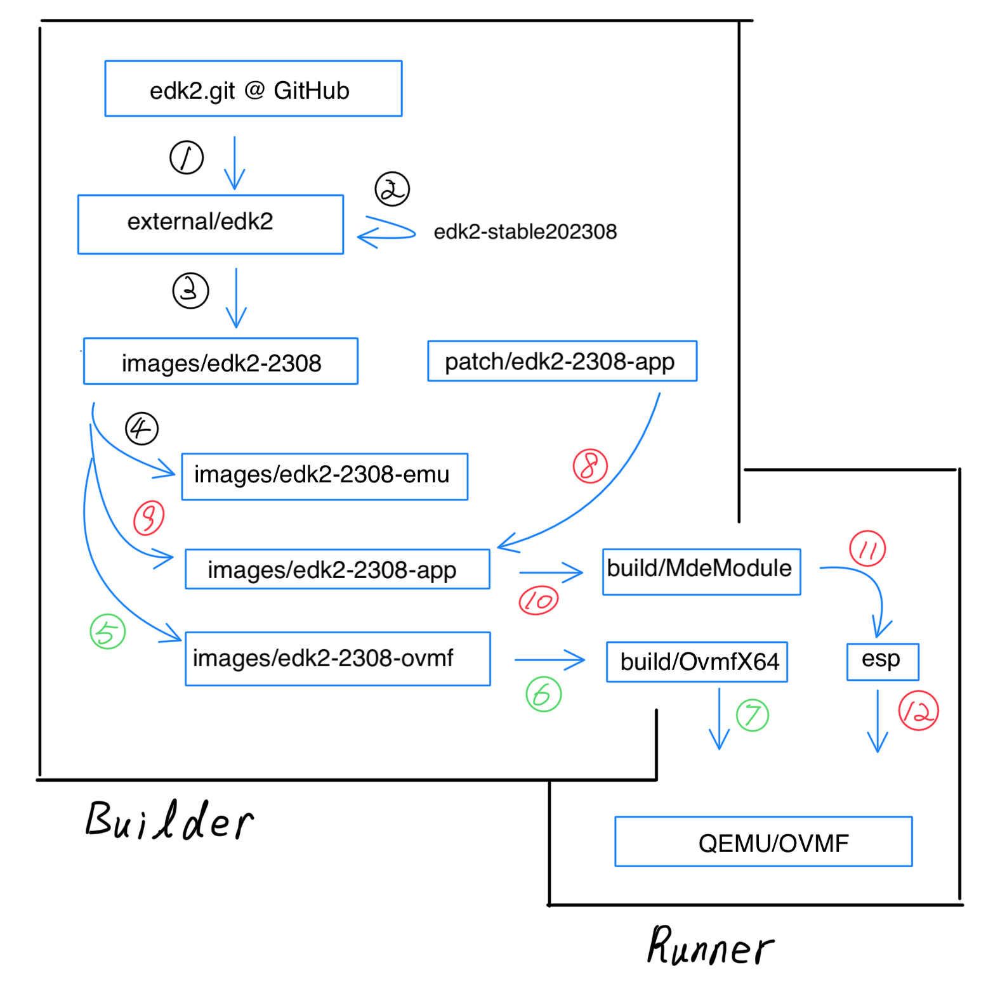
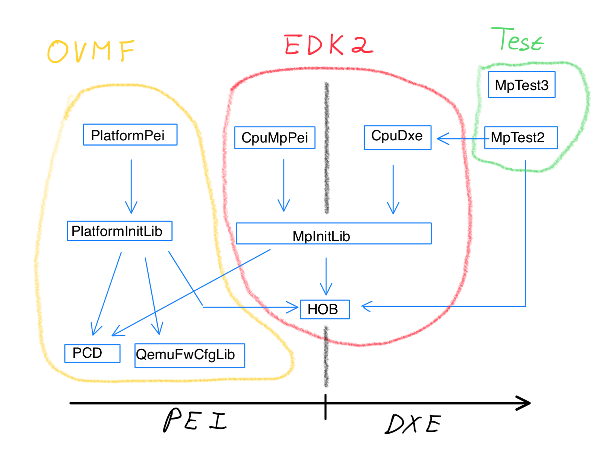

# Docker OVMF QEMU

Project: docker-ovmf-qemu
* The project provides dockers to build OVMF and run it in QEMU. The project also trace sources code of QVMF and EDK2 to answer the limitation of maximum CPU number. 

Version: 1.0

Released Date: 2024/1/27

Table of Contents
* Questions
* Answers
	* Q1 - Compiling OVMF by GCC and Linux tool chain
	* Q2 - What's the limitation of maximum CPU number in EDK2?
* Source Tree
	* Files in Top 
	* [documents]
	* [external]
	* [images]
	* [patch]
	* [build]
* Building Process
	* Machines
	* Process 1 - Prove EDK2 Workable
	* Process 2 - Build OVMF 
	* Process 3 - Trace Max CPU Number
* Trace Code
  * [OvmfPkg]
  * [OvmfPkg/PlatformPei]
  * [OvmfPkg/Library/PlatformInitLib]
  * [OvmfPkg/Include/IndustryStandard] 
  * [OvmfPkg/Library/QemuFwCfgLib]
  * [OvmfPkg/Include/Library]
  * [UefiCpuPkg/CpuMpPei]
  * [UefiCpuPkg/Library/MpInitLib]
  * [MdePkg/Library/PeiHobLib]  
* Experiment
  * [images/edk2-2308-ovmf2]
  * Run QEMU/OVMF with Debug Messages
  * MpTest3.efi
  * Try Limitation of Hob
  * [images/edk2-2308-ovmf]
  * Run QEMU/OVMF with One CPU
  * Run QEMU/OVMF with Two CPUs
  * MpTest2.efi
* Conclusion

# Questions

**Q1: Compiling OVMF by GCC and Linux tool chain**

Please explain the process for how to compiling OVMF by GCC and Linux tool
chain. We can use edk2-stable202308 or edk2-stable202311 version from
edk2 git. Architecture: x86-64

**Q2: What's the limitation of maximum CPU number in EDK2?**

Please trace the open source code of EDK2/OVMF to find out the limitation of maximum CPU number in EDK2.

For the two questions, we need to focus on x86-64 and refer to the following
repos and branches:

  - edk2-stable202108 verion tag on EDK2/OVMF git:
    https://github.com/tianocore/edk2.git

# Answers

## Q1 - Compiling OVMF by GCC and Linux tool chain (mandatory)

I summarize the process to build OVMF followed the requirements of the question, Q1.

1. Check out EDK2 source tree. https://github.com/tianocore/edk2.git
2. Select the version **edk2-stable202308** rather than **edk2-stable202311** beause I suppose the old version has more resources than the new one.
3. Prepare machines for the process. One is named **Builder**, and another is named **Runner**.
4. Use Sublime Text to create the project 2401-OVMF with a source tree, and used sftp-config.json to automatically synchronize files between **Builder** and **Runner**
5. Built Docker images to prepare EDK2 environment, build OVMF package, develop UEFI applications for automatically fast try and error.
6. Ask ChatGPT and Google when suffering problem. 

The detail of the process is described in **Source Tree** and **Building Process** chapters.

## Q2 - What's the limitation of maximum CPU number in EDK2? (optional)

The limitation of maximum CPU number in EDK2 is 2728. It is the answer of Q2. The reason is:
* The limitation of the data length in Hob restricts the number.
* HobLib.c ```ASSERT (DataLength <= (0xFFF8 - sizeof (EFI_HOB_GUID_TYPE)));``` 


In EDK2, the PcdCpuMaxLogicalProcessorNumber PCD defines maximum CPU number. But in QEMU, there is another mechanism to define the number.
* The mechanism is QEMU Firmware Configuration
* The default is one. We can chagne the number by -smp option by running qemu-system-x86_64. E.g., ```-smp 2```
* if ```-smp 256```, QEMU displays the error message ```qemu-system-x86_64: Invalid SMP CPUs 256. The max CPUs supported by machine 'pc-i440fx-8.2' is 255```.

The detail of Q2's answer is described in the **Trace Code** and **Experiment** chapters.

# Source Tree

The source tree, 2401-OVMF, is used to build EDK2/OVMF and to help answer Q1 and Q2. The "2401" in the name means "January, 2024" to indicate the year/month of the project beginning. 

Below is the source tree:
```
[2401-OVMF]
    README.md 
    README.html

    [documents]

    [external]
        [edk2]
        [MpTest1]
        Makefile
    
    [images]
        [edk2-2308] 
            Dockerfile
            Makefile
        [edk2-2308-emu]     
            Dockerfile
            Makefile        
        [edk2-2308-app]
            Dockerfile
            Makefile   
        [edk2-2308-ovmf]   
            Dockerfile
            Makefile        
        [edk2-2308-ovmf2]   
            Dockerfile
            Makefile  
    [patch]
        [edk2-2308-app]
            [MdeModulePkg]
                [Application]
                    [HelloWorld]
                        HelloWorld.c
                    [MpTest]
                        MpTest.c
                        MpTest.inf
                    [MpTest2]
                        MpTest2.c
                        MpTest2.inf
                    [MpTest3]
                        MpTest3.c
                        MpTest3.inf
                MdeModulePkg.dsc
        [edk2-2308-ovmf2]
            [OvmfPkg]
                OvmfPkgX64.dsc
            [UefiCpuPkg]
                [Library]
                    [MpInitLib]
                        MpLib.c
                        PeiMpLib.c
    [build]
```

## Files in Top 

README.md
* This is the file itself in Markdown format.

README.html
* This is the README file in HTML format.

## [documents]
* The directory contains documents and pictures.

## [external]

The directory contains all source code from GitHub repositories and from websites. The files in it are read-only. 

The purpose of the directory is:
1. To be a source of development. 
2. To trace source code.

The following are subdirectories and files, and we can read Makefile to find the clues of them.
```
[edk2]
[MpTest1]
Makefile
```

Makefile
```
#
# The below targets are run in the builder machine.
#

pull-1:
	git clone https://github.com/tianocore/edk2.git

pull-2:
	cd edk2 && \
	git checkout edk2-stable202308 && \
	git submodule update --init

#
# MPTest1 is got from https://www.lab-z.com/mpscpu/
#
```

## [images]

The directory generates Docker images to prepare EDK2 environment, build OVMF package, and develop UEFI applications.

The purpose of the directory is:
1. To isolate the building process from my machines environment.
2. To improve the speed of the project completion especially suffering  try-end-error many times.
3. To easily deliver the tasks to coleagues or release final production.

The following are subdirectories and files:
```
[edk2-2308] 
    Dockerfile
    Makefile
[edk2-2308-emu]     
    Dockerfile
    Makefile        
[edk2-2308-app]
    Dockerfile
    Makefile 
[edk2-2308-ovmf]   
    [esp]
        HelloWorld.efi
        MpTest.efi
        MpTest2.efi
        MpTest3.efi        
    Dockerfile
    Makefile        
[edk2-2308-ovmf2]   
    [esp]
        HelloWorld.efi
        MpTest.efi
        MpTest2.efi
        MpTest3.efi        
    Dockerfile
    Makefile   
```

[edk2-2308]
* The directory is used to build the Docker Image, edk2-2308.
* It is an origin image that can derive other images (E.g., edk2-2308-app, edk2-2308-emu, edk2-2308-ovmf, and edk2-2308-ovmf2.
* The image contains EDK2 of the edk2-stable202308 version.
* The image prepares EDK2 tool chain that has been built. 
* The Docker and Makefile files has details of the directory. The details are skiped here.

[edk2-2308-emu]
* The directory is used to build the Docker Image, edk2-2308-emu.
* The image is derived from edk2-2308.
* The image contains EDK2 of the edk2-stable202308 version.
* The image has built EmulatorPkg. 
* The image is used to proof that the edk2-stable202308 version is workable. 
* The Docker and Makefile files has details of the directory. The details are skiped here.

[edk2-2308-app]
* The directory is used to build the Docker Image, edk2-2308-app.
* The image is derived from edk2-2308.
* The image contains EDK2 of the edk2-stable202308 version.
* The image is used to develop UEFI applications.
* HelloWorld.efi, MpTest.efi, and MpTest2.efi have been built.
* The Docker and Makefile files has details of the directory. The details are skiped here.

[edk2-2308-ovmf]
* The directory is used to build the Docker Image, edk2-2308-ovmf.
* The image is derived from edk2-2308.
* The image contains EDK2 of the edk2-stable202308 version.
* The image has standard OvmfPkg that has been built.
* The directory [esp] contains UEFI applications (HelloWorld.efi, MpTest.efi, and MpTest2.efi) that are generated by edk2-2308-app and are run in UEFI shell in the QEMU/OVMF environment.
* The Docker and Makefile files has details of the directory. The details are skiped here.

[edk2-2308-ovmf2]
* The directory is used to build the Docker Image, edk2-2308-ovmf2.
* The image is derived from edk2-2308.
* The image contains EDK2 of the edk2-stable202308 version.
* The image is used to customize OvmfPkg to add debug messages.
* We deliver the executable OvmfPkg in QEMU to observe debug log for the Q2 question. 
* The directory [esp] contains UEFI applications same as esp in [edk2-2308-ovmf]
* The Docker and Makefile files has details of the directory. The details are skiped here.

Images dependency:
```
edk2-2308 <--- edk2-2308-emu
          <--- edk2-2308-app
          <--- edk2-2308-ovmf
          <--- edk2-2308-ovmf2
```

## [patch]

The directory contains patched files to override the original files from [external] directory.

The [patch/edk2-2308-app] directory is the patch of edk2-2308-app image.

The [patch/edk2-2308-ovmf2] directory is the patch of edk2-2308-ovmf2 image.

We can open the below Makefile to understand how to use the patches.

[images/edk2-2308-app]

Makefile
```
BUILDER_HOME = ~/work/2401-OVMF
IMG = edk2-2308-app
RUNER_HOME = /Users/visualge/Dropbox/CodeGit/2401-OVMF

#
# The below targets are run in the builder machine.
#

pre:
	mkdir -p build
	cp -r ${BUILDER_HOME}/patch/edk2-2308-app/ build/edk2/

d-build:
	docker build -t ${IMG} .

... ...
```

The **pre** target builds the [build] directory and copy the [edk2-2308-app] patch under the [build/edk2] directory that is under the [images/edk2-2308-app].

The **d-build** target builds the Docker image, edk2-2308-app by the below Dockerfile.

[images/edk2-2308-app]

Dockerfile
```
FROM edk2-2308 as base

#
# Patch files.
#

COPY build/edk2/ /work/edk2/
```

The command **COPY** copies the native [build/edk2] directory to the Docker container [/work/edk2] directory.

[images/edk2-2308-ovmf2]
* Makefile
  * The mechanism is samed as one in [images/edk2-2308-app]
* Dockerfile
  * The mechanism is samed as one in [images/edk2-2308-app]


## [build]

The directory contains files output from Docker containers.

# Building Process


The picture describes the building process of the OVMF homework. There are two machines (Builder and Runer), 3 processes with 10+ steps. Those are described below. 

## Machines

Builder
* The machine provides environment to prepare Docker images of EDK2.

Runner
* The machine provides environment to run QEMU/OVMF.

## Process 1 - Prove EDK2 Workable

The steps in the process are in Builder.

1. Clone EDK2 from edk2.git @ GitHub in the [external/edk2] directory.

[2401-OVMF/external]
```
$ make pull-1
```

2. Check out the edk2-stable202308 version.

[2401-OVMF/external]
```
$ make pull-2
```

3. Build edk2-2308 image.

[2401-OVMF/images/edk2-2308]
```
$ make d-rm
$ make clean
$ make pre
$ make d-build
$ make d-run-d
$ make d-exec
```

4. Build edk2-2308-emu image derived from edk2-2308 image.

[2401-OVMF/images/edk2-2308-emu]
```
$ make d-rm
$ make clean
$ make d-build
$ make d-run-d
$ make d-exec
```

## Process 2 - Build OVMF 

The steps in the process are involved in Builder and Runner. If a machine is not mentioned in a step, the default is Builder.

5. Build edk2-2308-ovmf image derived from edk2-2308 image.

[2401-OVMF/images/edk2-2308-ovmf]
```
$ make d-rm
$ make clean
$ make d-build
$ make d-run-d
$ make d-exec
```

6. Copy the produced OvmfX64 directory from the edk2-2308-ovmf container to the natvie [build/OvmfX64] directory.

[2401-OVMF/images/edk2-2308-ovmf]
```
$ make cp-from-docker
```

7. In Runner, remote copy the directory from Builder's [build/OvmfX86] to the native [build/OvmfX86], and run QEMU/OVMF.

[2401-OVMF/images/edk2-2308-ovmf]
```
$ make cp-from-builder
$ make run-ovmf
```

## Process 3 - Trace Max CPU Number

The steps in the process are involved in Builder and Runner. If a machine is not mentioned in a step, the default is Builder.

8. Copy [patch/edk2-2308-app] that contains source code of HelloWorld, MpTest, and MpTest1 to [images/edk2-2308-app/build]

[2401-OVMF/images/edk2-2308-app]
```
$ make pre
```

9. Build edk2-2308-app image derived from edk2-2308 image.

[2401-OVMF/images/edk2-2308-app]
```
$ make d-rm
$ make clean
$ make d-build
$ make d-run-d
$ make d-exec
```

10. Copy the produced MdeModule directory from the edk2-2308-app container to the natvie [build/MdeModule] directory.

[2401-OVMF/images/edk2-2308-app]
```
$ make cp-from-docker
```

11. In Runner, remote copy the directory from Builder's [build/MdeModule] to the native [esp]

[2401-OVMF/images/edk2-2308-app]
```
$ make cp-from-builder
```

[2401-OVMF/images/edk2-2308-ovmf]
```
$ make pre-esp
```

12. In Runner, Launch QEMU/OVMF with [esp] and manually run MpTest2.efi in it..

[2401-OVMF/images/edk2-2308-ovmf]
```
$ make run-ovmf-app
$ make run-ovmf-2-app
```

# Trace Code

The chapter traces source code of EDKII to expain the Q2 question (maximun CPU number).

Maximum CPU number in EDK2:
* The PcdCpuMaxLogicalProcessorNumber PCD defined maximum CPU number in a DSC file.
* The limitation of the data length in Hob restricts the number. The limitation of maximum CPU number is 2728.

Maximum CPU number in QEMU.
* QEMU Firmware Configuration specifies the number.
* The default is one. We can chagne the number by -smp option.
* The maximum of the option is 255.


The below picture describes the dependency of UEFI software components in the executable OVMF with timeline from PEI to DXE to help us trace source code about the Q2 question.


The picture has three scopes: OVMF, EDK2 and Test.

OVMF Scope
* It contains software components: PlatformPei, PlatformInitLib, and QemuFwCfgLib
* Those components are provided by OvmfPkg that is OVMF package.

EDK2 Scope
* It contains software components: CpuMpPei, CpuDxe, and MpInitLib
* Those components are provided by EDK2 standard pckages, MdePkg and UefiCpuPkg.

Test Scope
* It contains software components: MpTest2, MpTest3
* Thouse components are provided by me for the Q2 question.

The picture has two phases in timeline from left to right: PEI ---> DXE. 

Components are also run sequentially from left to right:
```
PlatformPei ---> CpuMpPei ---> CpuDxe ---> MpTest2 
                                      ---> MpTest3
```

PEI Phase
* PlatformPei PEI Driver
  * It is provided by OvmfPkg.
  * It reads a maximum CPU number from the PcdCpuMaxLogicalProcessorNumber PCD.
  * If QEMU frimware configuration is available, it reads a new maximum CPU number from the config to override the old one, and also updates the PcdCpuMaxLogicalProcessorNumber PCD. 
  * It creates a Hob of the gUefiOvmfPkgPlatformInfoGuid GUID with the EFI_HOB_PLATFORM_INFO structure to store the CPU number. The Hob is owned by OVMF, not by EDK2.
* CpuMpPei PEI Driver
  * It is provided by UefiCpuPkg.
  * It reads the PcdCpuMaxLogicalProcessorNumber PCD to get maximum CPU numbers.
  * It builds a Hob of MP_HANDOFF_GUID that contains CPUs information.
  * It appends the Hob in Hob list.


DXE Phase
* CpuDxe DXE Driver
  * It reads the Hob of MP_HANDOFF_GUID to create the EFI_MP_SERVICES_PROTOCOL protocol.
  * It installs the protocol. 
* MpTest2 UEFI Application
  * It consums the EFI_MP_SERVICES_PROTOCOL protocol and the EFI_HOB_PLATFORM_INFO Hob to report CPU numbers and some of QEMU firmware configurations.
* MpTest3 UEFI Application
  * It doesn't consums any protocols and Hobs.
  * It calculates the limitation of maximum CPU number.


## [OvmfPkg]

OvmfPkgX64.dsc
```
  # UefiCpuPkg PCDs related to initial AP bringup and general AP management.
  gUefiCpuPkgTokenSpaceGuid.PcdCpuMaxLogicalProcessorNumber|64
  gUefiCpuPkgTokenSpaceGuid.PcdCpuBootLogicalProcessorNumber|0
```
The maximun CPU number is defined by the PcdCpuMaxLogicalProcessorNumber PCD as 64.


## [OvmfPkg/PlatformPei]

Platform.c:300
```
EFI_STATUS
EFIAPI
InitializePlatform (
  IN       EFI_PEI_FILE_HANDLE  FileHandle,
  IN CONST EFI_PEI_SERVICES     **PeiServices
  )
{
  PlatformInfoHob = BuildPlatformInfoHob ();
  ...
  PlatformInfoHob->DefaultMaxCpuNumber = PcdGet32 (PcdCpuMaxLogicalProcessorNumber);

  MaxCpuCountInitialization (PlatformInfoHob);
}
```
The PEI driver entry function, InitializePlatform, initializes the platform. It calls MaxCpuCountInitialization() to get max CPU numbers.

Platform.c:259
```
VOID
MaxCpuCountInitialization (
  IN OUT EFI_HOB_PLATFORM_INFO  *PlatformInfoHob
  )
{
  RETURN_STATUS  PcdStatus;

  PlatformMaxCpuCountInitialization (PlatformInfoHob);

  PcdStatus = PcdSet32S (PcdCpuBootLogicalProcessorNumber, PlatformInfoHob->PcdCpuBootLogicalProcessorNumber);
  ASSERT_RETURN_ERROR (PcdStatus);
  PcdStatus = PcdSet32S (PcdCpuMaxLogicalProcessorNumber, PlatformInfoHob->PcdCpuMaxLogicalProcessorNumber);
  ASSERT_RETURN_ERROR (PcdStatus);
}
```
The function calls PlatformMaxCpuCountInitialization() to assign max CPU number in PlatformInfoHob.

## [OvmfPkg/Library/PlatformInitLib]

Platform.c:552
```
VOID
EFIAPI
PlatformMaxCpuCountInitialization (
  IN OUT EFI_HOB_PLATFORM_INFO  *PlatformInfoHob
  )
{
  UINT16  BootCpuCount = 0;
  UINT32  MaxCpuCount;
  if (QemuFwCfgIsAvailable ()) {
    QemuFwCfgSelectItem (QemuFwCfgItemSmpCpuCount);
    BootCpuCount = QemuFwCfgRead16 ();
  }

  if (BootCpuCount == 0) {
    MaxCpuCount = PlatformInfoHob->DefaultMaxCpuNumber;
  } else {
    ...
    PlatformCpuCountBugCheck (&BootCpuCount, &Present, &Possible);
    MaxCpuCount = Possible;
  }
  ... ...
  PlatformInfoHob->PcdCpuMaxLogicalProcessorNumber  = MaxCpuCount;
  PlatformInfoHob->PcdCpuBootLogicalProcessorNumber = BootCpuCount;
}
```
* The function calls QemuFwCfgIsAvailable() that is returned 1 if launch QEMU.
* The BootCpuCount is read from QEMU firmware configuration by I/O access routines (QemuFwCfgSelectItem() and QemuFwCfgRead16()).
* The function updates the two PCDs in the HOB. 


## [OvmfPkg/Include/IndustryStandard] 
QemuFwCfg.h:50
```
typedef enum {
  ...
  QemuFwCfgItemSmpCpuCount        = 0x0005,
  ...
}
```
The QemuFwCfgItemSmpCpuCount enumerated value defines max CPU number in QEMU firmware configuration. 

## [OvmfPkg/Library/QemuFwCfgLib]

QemuFwCfgPei.c:51
```
BOOLEAN
EFIAPI
QemuFwCfgIsAvailable (
  VOID
  )
{
  return InternalQemuFwCfgIsAvailable ();
}
```
The function calls InternalQemuFwCfgIsAvailable() that is returned 1.

QemuFwCfgPei.c:142
```
BOOLEAN
InternalQemuFwCfgIsAvailable (
  VOID
  )
{
  EFI_HOB_PLATFORM_INFO  *PlatformInfoHob = QemuFwCfgGetPlatformInfo ();

  return PlatformInfoHob->QemuFwCfgSupported;
}
```
The function calls get QemuFwCfgGetPlatformInfo to update/get PlatformInfoHob and returned QemuFwCfgSupported that is 1.

QemuFwCfgPei.c:96
```
STATIC
EFI_HOB_PLATFORM_INFO *
QemuFwCfgGetPlatformInfo (
  VOID
  )
{
  ...
  if (!PlatformInfoHob->QemuFwCfgChecked) {
    QemuFwCfgProbe (
      &PlatformInfoHob->QemuFwCfgSupported,
      &PlatformInfoHob->QemuFwCfgDmaSupported
      );
    PlatformInfoHob->QemuFwCfgChecked = TRUE;
  }
  ...
}
```
* The function checks QemuFwCfgChecked. **The value of QemuFwCfgChecked should be FALSE.**
* The function calls QemuFwCfgProbe to get QemuFwCfgSupported anb QemuFwCfgDmaSupported.
* The function assigns QemuFwCfgChecked as TRUE.

QemuFwCfgPei.c:60
```
STATIC
VOID
QemuFwCfgProbe (
  BOOLEAN  *Supported,
  BOOLEAN  *DmaSupported
  )
{
  IoWrite16 (FW_CFG_IO_SELECTOR, (UINT16)QemuFwCfgItemSignature);
  IoReadFifo8 (FW_CFG_IO_DATA, sizeof Signature, &Signature);
  IoWrite16 (FW_CFG_IO_SELECTOR, (UINT16)QemuFwCfgItemInterfaceVersion);
  IoReadFifo8 (FW_CFG_IO_DATA, sizeof Revision, &Revision);
  ...
  *Supported    = FALSE;
  *DmaSupported = FALSE;
  if ((Signature == SIGNATURE_32 ('Q', 'E', 'M', 'U')) && (Revision >= 1)) {
    *Supported = TRUE;
    if ((Revision & FW_CFG_F_DMA) && !CcGuest) {
      *DmaSupported = TRUE;
    }
  }
  ...
}
```
* The function get Signature and Revision of QEMU firmware configuration by calling I/O access routines.
* The function returned Supported that is TRUE.


## [OvmfPkg/Include/Library]

PlatformInitLib.h:15
```
typedef struct {
  ...
  UINT32               PcdCpuBootLogicalProcessorNumber;
  UINT32               PcdCpuMaxLogicalProcessorNumber;
  UINT32               DefaultMaxCpuNumber;
  ...
  BOOLEAN              QemuFwCfgChecked;
  BOOLEAN              QemuFwCfgSupported;
  BOOLEAN              QemuFwCfgDmaSupported;
} EFI_HOB_PLATFORM_INFO;
```
* The header file defines HOB variables about max CPU number and QEMU firmware configuration supported.

## [UefiCpuPkg/CpuMpPei]

CpuMpPei.c:553
```
EFI_STATUS
InitializeCpuMpWorker (
  IN CONST EFI_PEI_SERVICES  **PeiServices
  )
{
  ...
  
  Status = MpInitLibInitialize ();
  ...
  Status = PeiServicesInstallPpi (mPeiCpuMpPpiList);
}
```
* The function calls MpInitLibInitialize().
* The function calls PeiServicesInstallPpi() to install the mPeiCpuMpPpiList PPI.


## [UefiCpuPkg/Library/MpInitLib]

MpLib.c:1985
```
EFI_STATUS
EFIAPI
MpInitLibInitialize (
  VOID
  )
{
  ...
  MpHandOff = GetMpHandOffHob ();
  if (MpHandOff == NULL) {
    MaxLogicalProcessorNumber = PcdGet32 (PcdCpuMaxLogicalProcessorNumber);
  } else {
    MaxLogicalProcessorNumber = MpHandOff->CpuCount;
  }
```
* The function reads MaxLogicalProcessorNumber from PCD when it is firstly called.
* The function reads MaxLogicalProcessorNumber from Hob when it is secondly called.
```
  ...
  CpuMpData = (CPU_MP_DATA *)(ApIdtBase + VolatileRegisters.Idtr.Limit + 1);
  ...
  CpuMpData->CpuInfoInHob = (UINT64)(UINTN)
                            (CpuMpData->CpuData + MaxLogicalProcessorNumber);
```
* Use the CpuMpData pointer to indicate CPU_MP_DATA data from the ApIdtBase address.
* Use the CpuMpData->CpuInfoInHob pointer to indicate CPU information by jump bytes of sizeof(CPU_MP_DATA) * MaxLogicalProcessorNumber from the CpuMpData->CpuData address.
```
  ...
  ASSERT (
    (CpuMpData->CpuInfoInHob + sizeof (CPU_INFO_IN_HOB) * MaxLogicalProcessorNumber)
    == (UINTN)MpBuffer + BufferSize - (ApStackSize - Buffer + (UINTN)MpBuffer));
  ...
  if (MpHandOff == NULL) {
    if (MaxLogicalProcessorNumber > 1) {
      //
      // Wakeup all APs and calculate the processor count in system
      //
      CollectProcessorCount (CpuMpData);
    }
  } else {
  }
```
* If the function is firstly called, MpHandOff is NULL. 
  * If MaxLogicalProcessorNumber >= 2, it calls CollectProcessorCount() to wakeup all APs as the comment and calculate CPU count. 
```
  ...
  InitMpGlobalData (CpuMpData);
}
```
* It calls InitMpGlobalData() to build a Hob for CpuMpData.


MpLib.c:1956
```
MP_HAND_OFF *
GetMpHandOffHob (
  VOID
  )
{
  EFI_HOB_GUID_TYPE  *GuidHob;
  MP_HAND_OFF        *MpHandOff;

  MpHandOff = NULL;
  GuidHob   = GetFirstGuidHob (&mMpHandOffGuid);
  if (GuidHob != NULL) {
    MpHandOff = (MP_HAND_OFF *)
                GET_GUID_HOB_DATA (GuidHob);
  }

  return MpHandOff;
}
```
* The function gets MP_HAND_OFF from Hob list.
* If MP_HAND_OFF is not in Hob list, return NULL.

MpLib.c:505
```
UINTN
CollectProcessorCount (
  IN CPU_MP_DATA  *CpuMpData
  )
{
  ...
  //
  // Send 1st broadcast IPI to APs to wakeup APs
  //
  CpuMpData->InitFlag = ApInitConfig;
  WakeUpAP (CpuMpData, TRUE, 0, NULL, NULL, TRUE);
  CpuMpData->InitFlag = ApInitDone;
  ...
  CpuMpData->CpuCount = CpuMpData->FinishedCount + 1;
  ASSERT (CpuMpData->CpuCount <= PcdGet32 (PcdCpuMaxLogicalProcessorNumber));
  ...
}
```
* The function is called by BSP to wake up APs.
  * BSP: Bootstrap Processor
  * AP: Application Processor
* The FinishedCount means the number of APs that are woken up.
* CpuCount = FinishedCount (the APs) + 1 (the BSP itself)

PeiMpLib.c:438
```
VOID
InitMpGlobalData (
  IN CPU_MP_DATA  *CpuMpData
  )
{
  EFI_STATUS  Status;

  BuildMicrocodeCacheHob (CpuMpData);
  SaveCpuMpData (CpuMpData);

  ///
  /// Install Notify
  ///
  Status = PeiServicesNotifyPpi (&mS3SmmInitDoneNotifyDesc);
  ASSERT_EFI_ERROR (Status);
}
```
* The function calls BuildMicrocodeCacheHob() and  SaveCpuMpData() to build Hobs to store information about CpuMpData.

PeiMpLib.c:124
```
VOID
SaveCpuMpData (
  IN CPU_MP_DATA  *CpuMpData
  )
{
  CpuInfoInHob  = (CPU_INFO_IN_HOB *)(UINTN)CpuMpData->CpuInfoInHob;
  MpHandOffSize = sizeof (MP_HAND_OFF) + 
                  sizeof (PROCESSOR_HAND_OFF) * CpuMpData->CpuCount;
  MpHandOff = (MP_HAND_OFF *)BuildGuidHob (&mMpHandOffGuid, MpHandOffSize);
  ASSERT (MpHandOff != NULL);
  ZeroMem (MpHandOff, MpHandOffSize);
  MpHandOff->ProcessorIndex = 0;

  MpHandOff->CpuCount = CpuMpData->CpuCount;
  ...
  //
  // Build location of CPU MP DATA buffer in HOB
  //
  Data64 = (UINT64)(UINTN)CpuMpData;
  BuildGuidDataHob (
    &mCpuInitMpLibHobGuid,
    (VOID *)&Data64,
    sizeof (UINT64)
    );
}
```
* The function save CpuMpData in Hobs: mMpHandOffGuid and mCpuInitMpLibHobGuid.
* It calls BuildGuidHob() to build the Hob MpHandOff to store CpuMpData.
* It calls BuildGuidDataHob() to build the Hob of mCpuInitMpLibHobGuid as comment.


## [MdePkg/Library/PeiHobLib]  

HobLib.c:405
```
VOID *
EFIAPI
BuildGuidHob (
  IN CONST EFI_GUID  *Guid,
  IN UINTN           DataLength
  )
{
  EFI_HOB_GUID_TYPE  *Hob;

  //
  // Make sure Guid is valid
  //
  ASSERT (Guid != NULL);

  //
  // Make sure that data length is not too long.
  //
  ASSERT (DataLength <= (0xFFF8 - sizeof (EFI_HOB_GUID_TYPE)));

  Hob = InternalPeiCreateHob (EFI_HOB_TYPE_GUID_EXTENSION, 
        (UINT16)(sizeof (EFI_HOB_GUID_TYPE) + DataLength));
  if (Hob == NULL) {
    return Hob;
  }

  CopyGuid (&Hob->Name, Guid);
  return Hob + 1;
}
```
* The function creates a Hob with DataLength bytes.
* The ASSERT is used to ensure that DataLength is at most 65504 bytes.
  * 0xFFF8 - sizeof (EFI_HOB_GUID_TYPE) = 65504 (bytes)
    * sizeof (EFI_HOB_GUID_TYPE) = 24 (bytes)


# Experiment

## [images/edk2-2308-ovmf2]

We use the edk2-2308-ovmf2 image to customize OvmfPkg with debug messages so that we can observe the maximum CPU number in PEI phase.

We can use the targets to observe it.

[2401-OVMF/images/edk2-2308-ovmf]

Makefile
```
run-ovmf-d:
  qemu-system-x86_64 \
  -drive file=${RUNER_HOME}/build/edk2-2308-ovmf2/OvmfX64/DEBUG_GCC5/FV/OVMF.fd,if=pflash,format=raw \
  -vga std \
  -net none \
  -debugcon file:debug.log \
  -global isa-debugcon.iobase=0x402

run-ovmf-2-d:
  qemu-system-x86_64 \
  -drive file=${RUNER_HOME}/build/edk2-2308-ovmf2/OvmfX64/DEBUG_GCC5/FV/OVMF.fd,if=pflash,format=raw \
  -vga std \
  -net none \
  -smp 2 \
  -debugcon file:debug.log \
  -global isa-debugcon.iobase=0x402 

run-ovmf-255-d:
  qemu-system-x86_64 \
  -drive file=${RUNER_HOME}/build/edk2-2308-ovmf2/OvmfX64/DEBUG_GCC5/FV/OVMF.fd,if=pflash,format=raw \
  -vga std \
  -net none \
  -smp 255 \
  -debugcon file:debug.log \
  -global isa-debugcon.iobase=0x402 

run-ovmf-256-d:
  qemu-system-x86_64 \
  -drive file=${RUNER_HOME}/build/edk2-2308-ovmf2/OvmfX64/DEBUG_GCC5/FV/OVMF.fd,if=pflash,format=raw \
  -vga std \
  -net none \
  -smp 256 \
  -debugcon file:debug.log \
  -global isa-debugcon.iobase=0x402   

run-ovmf-app:
  qemu-system-x86_64 \
  -drive file=${RUNER_HOME}/build/edk2-2308-ovmf2/OvmfX64/DEBUG_GCC5/FV/OVMF.fd,if=pflash,format=raw \
  -vga std \
  -net none \
  -drive file=fat:rw:esp,index=0,format=vvfat
```

The run-ovmf-d target:
* Run QEMU with debug messages that are saved in debug.log.

The run-ovmf-2-d target:
* Run QEMU with debug messages that are saved in debug.log.
* The QEMU enables two CPUs.

The run-ovmf-255-d target:
* Run QEMU with debug messages that are saved in debug.log.
* The QEMU enables 255 CPUs.

The run-ovmf-256-d target:
* Run QEMU with debug messages that are saved in debug.log
* The QEMU enables 256 CPUs.

The run-ovmf-app target:
* The QEMU uses the esp directory as a file system named FS0.
* We can put our UEFI Application files (e.g., MpTest2.efi and MpTest3.efi) in the directory, and run them at UEFI Shell in the QEMU/OVMF environment.  

## Run QEMU/OVMF with Debug Messages

[2401-OVMF/images/edk2-2308-ovmf]
```
% make run-ovmf-d
```

debug.log
```
...
Loading PEIM at 0x00000834FC0 EntryPoint=0x0000083CBD3 PlatformPei.efi
...
Loading PEIM at 0x00007EC9000 EntryPoint=0x00007ECD958 CpuMpPei.efi
...
Notify: PPI Guid: F894643D-C449-42D1-8EA8-85BDD8C65BDE, Peim notify entry point: 7ED3407
...
@2018: MaxLogicalProcessorNumber = 1
@2024: MaxLogicalProcessorNumber = 1
...
GetMicrocodePatchInfoFromHob: Microcode patch cache HOB is not found.
CPU[0000]: Microcode revision = 00000000, expected = 00000000
...
@142: CpuCount = 1
@145: MP_HAND_OFF = 16
@146: PROCESSOR_HAND_OFF = 24
@147: MpHandOffSize = 40
@148: EFI_HOB_GUID_TYPE = 24
...
Loading driver at 0x00006CFD000 EntryPoint=0x00006D0203B CpuDxe.efi
ConvertPages: failed to find range FD00000000 - FFFFFFFFFF
...
@2020: MaxLogicalProcessorNumber = 1
@2024: MaxLogicalProcessorNumber = 1
```

Observation:
* The order of UEFI PEI/DXE driver running is PlatformPei.efi ---> CpuMpPei.efi ---> and  CpuDxe.efi
* MaxLogicalProcessorNumber is assigned twice by calling MpInitLibInitialize() twice. CpuMpPei.efi calls MpInitLibInitialize() and CpuDxe.efi calls it again.
* CpuCount = 1 means that the PEI driver detects 1 CPU and saves CPU info with 40 (MpHandOffSize) bytes in a Hob.
* The system can boot the UEFI shell.

```
% make run-ovmf-2-d
```

debug.log
```
     @2018: MaxLogicalProcessorNumber = 2
     @2024: MaxLogicalProcessorNumber = 2

     @528: CpuMpData->CpuCount = 2
     @529: PcdCpuMaxLogicalProcessorNumber  = 2
     
     @142: CpuCount = 2
     @145: MP_HAND_OFF = 16
     @146: PROCESSOR_HAND_OFF = 24
     @147: MpHandOffSize = 64
     @148: EFI_HOB_GUID_TYPE = 24

     @2020: MaxLogicalProcessorNumber = 2
     @2024: MaxLogicalProcessorNumber = 2
```

Observation:
* The message @528 means that CollectProcessorCount() is called to wakeup all APs. 
* CpuCount = 2 means that the PEI driver detects two CPUs and saves CPUs info with 64 (MpHandOffSize) bytes in a Hob.
* The system can boot the UEFI shell.

```
% make run-ovmf-255-d
```

debug.log
```
     @2018: MaxLogicalProcessorNumber = 255
     @2024: MaxLogicalProcessorNumber = 255

     @528: CpuMpData->CpuCount = 255
     @529: PcdCpuMaxLogicalProcessorNumber  = 255     

     @142: CpuCount = 255
     @145: MP_HAND_OFF = 16
     @146: PROCESSOR_HAND_OFF = 24
     @147: MpHandOffSize = 6136
     @148: EFI_HOB_GUID_TYPE = 24

     @2020: MaxLogicalProcessorNumber = 255
     @2024: MaxLogicalProcessorNumber = 255     
```

Observation:
* The message @528 means that CollectProcessorCount() is called to wakeup all APs. 
* CpuCount = 255 means that the PEI driver detects 255 CPUs and saves CPUs info with 6136 (MpHandOffSize) bytes in a Hob.
* The system can boot the UEFI shell.

```
% make run-ovmf-256-d
qemu-system-x86_64: Invalid SMP CPUs 256. The max CPUs supported by machine 'pc-i440fx-8.2' is 255
```

Observation:
* The system hangs because the limitation of max CPU number supported by QEMU is 255.

```
% make run-ovmf-app
```

[QEMU/OVMF UEFI Shell]
```
Shell> FS0:
FS0:> MpTest3.efi
MpTest3..........
MpHandOffSize        : 10h (16) 
ProcessorHandOffSize : 18h (24)
HobGuidTypeSize      : 18h (24)

MaxDataLength : FFE0h (65504)
MaxCpuCount   : AA8h (2728)
```

Observation:
* Use MpTest3.efi to calculate the maximum data length of a Hob is 65504 bytes.
* It restricts the limitation of maximum CPU number is 2728.

## MpTest3.efi

The MpTest3.efi calculates the limitation of maximum CPU number in Hob.

[2401-OVMF/patch/edk2-2308-app/MdeModulePkg/Application/MpTest3] 

MpTest3.c
```
...
EFI_STATUS
EFIAPI
UefiMain (
  IN EFI_HANDLE        ImageHandle,
  IN EFI_SYSTEM_TABLE  *SystemTable
  )
{
  UINTN MpHandOffSize;
  UINTN ProcessorHandOffSize;
  UINTN HobGuidTypeSize;
  UINTN MaxDataLength;
  UINTN MaxCpuCount;

  Print (L"MpTest3..........\n");

  MpHandOffSize = sizeof(MP_HAND_OFF);
  ProcessorHandOffSize = sizeof(PROCESSOR_HAND_OFF);  
  HobGuidTypeSize = sizeof(EFI_HOB_GUID_TYPE);

  Print(L"MpHandOffSize        : %xh (%d)\n", MpHandOffSize, MpHandOffSize);
  Print(L"ProcessorHandOffSize : %xh (%d)\n", ProcessorHandOffSize, ProcessorHandOffSize);
  Print(L"HobGuidTypeSize      : %xh (%d)\n", HobGuidTypeSize, HobGuidTypeSize);
  Print(L"\n");

  //
  // MaxDataLength = 0xFFF8 - HobGuidTypeSize
  //

  MaxDataLength = 0XFFF8 - HobGuidTypeSize;
  Print(L"MaxDataLength : %xh (%d)\n", MaxDataLength, MaxDataLength);

  //
  // MaxDataLength = MpHandOffSize + ProcessorHandOffSize * MaxCpuCount
  // MaxCpuCount = (MaxDataLength - MpHandOffSize) / ProcessorHandOffSize
  //

  MaxCpuCount = (MaxDataLength - MpHandOffSize) / ProcessorHandOffSize;
  Print(L"MaxCpuCount   : %xh (%d)\n", MaxCpuCount, MaxCpuCount);

  return EFI_SUCCESS;
}
```

## Try Limitation of Hob

[2401-OVMF/patch/edk2-2308-ovmf2/UefiCpuPkg/Library/MpInitLib]

PeiMpLib.c
```
VOID
SaveCpuMpData (
  IN CPU_MP_DATA  *CpuMpData
  )
{
  ...
  CpuMpData->CpuCount = 2278;
  DEBUG ((DEBUG_INFO, "142: CpuCount = %d\n", CpuMpData->CpuCount)); // Count
```

```
% make run-ovmf-d
```

debug.log
```
@2018: MaxLogicalProcessorNumber = 1
@2024: MaxLogicalProcessorNumber = 1

@142: CpuCount = 2728
@145: MP_HAND_OFF = 16
@146: PROCESSOR_HAND_OFF = 24
@147: MpHandOffSize = 65488
@148: EFI_HOB_GUID_TYPE = 24

@2020: MaxLogicalProcessorNumber = 2728
@2024: MaxLogicalProcessorNumber = 2728
ASSERT /work/edk2/UefiCpuPkg/Library/MpInitLib/MpLib.c(2054): MpBuffer != ((void *) 0)
```

Observation:
* CpuCount = 2728 means that the PEI driver detects 2728 CPUs and saves CPUs info with 65488 (MpHandOffSize) bytes in a Hob.
* The system hangs on MpLib.c(2054) because there is not enough memory to allocate a buffer to store AP stacks.


PeiMpLib.c
```
VOID
SaveCpuMpData (
  IN CPU_MP_DATA  *CpuMpData
  )
{
  ...
  CpuMpData->CpuCount = 2279;
  DEBUG ((DEBUG_INFO, "142: CpuCount = %d\n", CpuMpData->CpuCount)); // Count
```

```
% make run-ovmf-d
```

debug.log
```
@2018: MaxLogicalProcessorNumber = 1
@2024: MaxLogicalProcessorNumber = 1

@142: CpuCount = 2729
@145: MP_HAND_OFF = 16
@146: PROCESSOR_HAND_OFF = 24
@147: MpHandOffSize = 65512
@148: EFI_HOB_GUID_TYPE = 24
ASSERT /work/edk2/MdePkg/Library/PeiHobLib/HobLib.c(422): DataLength <= (0xFFF8 - sizeof (EFI_HOB_GUID_TYPE))
```

Observation:
* CpuCount = 2729 means that the PEI driver detects 2729 CPUs and wants to save CPUs info with 65512 (MpHandOffSize) bytes in a Hob.
* The system hangs on HobLib.c(422) because the data length of a hob is at most 65504 bytes. The data length, 65512 (MpHandOffSize) bytes, is out of the range.


## [images/edk2-2308-ovmf]

We can use the two targets run-ovmf-app and run-ovmf-2-app to test the CPU number in QEMU/OVMF environment. 

[2401-OVMF/images/edk2-2308-ovmf]

Makefile
```
run-ovmf-app:
  qemu-system-x86_64 \
  -drive file=${RUNER_HOME}/build/OvmfX64/DEBUG_GCC5/FV/OVMF.fd,if=pflash,format=raw \
  -vga std \
  -net none \
  -drive file=fat:rw:esp,index=0,format=vvfat

run-ovmf-2-app:
  qemu-system-x86_64 \
  -drive file=${RUNER_HOME}/build/OvmfX64/DEBUG_GCC5/FV/OVMF.fd,if=pflash,format=raw \
  -vga std \
  -net none \
  -drive file=fat:rw:esp,index=0,format=vvfat \
  -smp 2
```

## Run QEMU/OVMF with One CPU

[2401-OVMF/images/edk2-2308-ovmf]
```
% make run-ovmf-app
```

[QEMU/OVMF UEFI Shell]
```
Shell> FS0:
FS0:> MpTest2.efi
MpTest..........
Number of Processors 1
Number of Enabled Processors 1
Report CPU numbers from PlatformInfoHob.
MaxCpuCount           = 1
BootCpuCount          = 1
DefaultMaxCpuCount    = 64
QemuFwCfgChecked      = 1
QemuFwCfgSupported    = 1
QemuFwCfgDmaSupported = 1
```


## Run QEMU/OVMF with Two CPUs

[2401-OVMF/images/edk2-2308-ovmf]
```
% make run-ovmf-2-app
```

[QEMU/OVMF UEFI Shell]
```
Shell> FS0:
FS0:> MpTest2.efi
MpTest..........
Number of Processors 2
Number of Enabled Processors 2
Report CPU numbers from PlatformInfoHob.
MaxCpuCount           = 2
BootCpuCount          = 2
DefaultMaxCpuCount    = 64
QemuFwCfgChecked      = 1
QemuFwCfgSupported    = 1
QemuFwCfgDmaSupported = 1
```

## MpTest2.efi

The MpTest2.efi consumes HOB and EFI_MP_SERVICES_PROTOCOL to get CPU numbers and a part of QEMU firmware configuration.

[2401-OVMF/patch/edk2-2308-app/MdeModulePkg/Application/MpTest2]

MpTest2.c
```
EFI_STATUS
EFIAPI
UefiMain (
  IN EFI_HANDLE        ImageHandle,
  IN EFI_SYSTEM_TABLE  *SystemTable
  )
{
  EFI_STATUS Status;
  EFI_MP_SERVICES_PROTOCOL *Mp = NULL;
  UINTN NumProcessors;
  UINTN NumberOfEnabledProcessors;  
  //EFI_HOB_GENERIC_HEADER *CurrentHob;
  EFI_HOB_GUID_TYPE      *GuidHob;
  EFI_HOB_PLATFORM_INFO *PlatformInfoHob;  
  UINT32 MaxCpuCount;
  UINT32 BootCpuCount;
  UINT32 DefaultMaxCpuCount;
  BOOLEAN QemuFwCfgChecked;
  BOOLEAN QemuFwCfgSupported;
  BOOLEAN QemuFwCfgDmaSupported;

  Print (L"MpTest..........\n");

  //
  // Locate MP_Service Protocol
  //

  Status = gBS->LocateProtocol(&gEfiMpServiceProtocolGuid, NULL, (VOID**)&Mp);
  if (EFI_ERROR (Status)) {
    Print(L"Unable to initialize MP protocol interface!");
    return EFI_UNSUPPORTED;
  }  

  //
  // Determine number of processors
  //

  Status = Mp->GetNumberOfProcessors(Mp, &NumProcessors , &NumberOfEnabledProcessors);
  if (EFI_ERROR(Status)) {
    Print( L"Mp->GetNumEnabledProcessors(): Unable to determine number of processors.\n") ;
    return EFI_UNSUPPORTED;
  }

  //
  // Report the processors.
  //

  Print(L"Number of Processors %d\n", NumProcessors);
  Print(L"Number of Enabled Processors %d\n", NumberOfEnabledProcessors);  

  //
  // Get the start of the HOB List from the system table or DXE services
  //

  GuidHob = GetFirstGuidHob(&gUefiOvmfPkgPlatformInfoGuid);
  if (GuidHob == NULL) {
     Print(L"PlatformInfoHob is not found.\n");
     return EFI_UNSUPPORTED;
  }

  //
  // Report CPU numbers from PlatformInfoHob.
  //

  PlatformInfoHob = (EFI_HOB_PLATFORM_INFO *) GET_GUID_HOB_DATA(GuidHob);

  Print(L"Report CPU numbers from PlatformInfoHob.\n");  

  MaxCpuCount = PlatformInfoHob->PcdCpuMaxLogicalProcessorNumber;
  BootCpuCount = PlatformInfoHob->PcdCpuBootLogicalProcessorNumber;
  DefaultMaxCpuCount = PlatformInfoHob->DefaultMaxCpuNumber;
  QemuFwCfgChecked = PlatformInfoHob->QemuFwCfgChecked;
  QemuFwCfgSupported = PlatformInfoHob->QemuFwCfgSupported;
  QemuFwCfgDmaSupported = PlatformInfoHob->QemuFwCfgDmaSupported;


  Print(L"MaxCpuCount           = %d\n", MaxCpuCount);
  Print(L"BootCpuCount          = %d\n", BootCpuCount);
  Print(L"DefaultMaxCpuCount    = %d\n", DefaultMaxCpuCount);
  Print(L"QemuFwCfgChecked      = %d\n", QemuFwCfgChecked);
  Print(L"QemuFwCfgSupported    = %d\n", QemuFwCfgSupported);
  Print(L"QemuFwCfgDmaSupported = %d\n", QemuFwCfgDmaSupported);

  return EFI_SUCCESS;
}
```

# Conclusion

I built the 2401-OVMF project to help me answer the two questions: Q1 and Q2.

I described hwo to use the project to build OVMF followed the requirements of the Q1 question.

For the Q2 questions, the limitation of maximum CPU number in EDK2 is 2728. It is the answer of Q2.

I also observed that: 
1) In EDK2, although a Hob can store information for 2728 CPUs, the system is still failed to allocate memory space for storing AP stacks.  
2) In EDK2, the PcdCpuMaxLogicalProcessorNumber PCD defines maximum CPU number in a DSC file.
3) In QEMU, the number is specified by QEMU Firmware Configuration. It overrides the PcdCpuMaxLogicalProcessorNumber PCD.
4) The default is one. We can chagne the number by -smp option by running qemu-system-x86_64. E.g., ```-smp 2```
5) if ```-smp 256```, QEMU/OVMF hangs because the max CPU number supported by QEMU is 255.
6) if ```-smp 255```, QEMU/OVMF can boot the UEFI shell. 
7) QemuFwCfgChecked and QemuFwCfgSupported are always 1. Therefore QEMU firmware configuration finally decides HOB.


# Log

## 2024/1/22

Answers of ChatGTP
* [2024-01-22.html](documents/2024-01-22.html)

## 2024/1/23

Answers of ChatGTP
* [2024-01-23.html](documents/2024-01-23.html)

## 2024/1/24

Answers of ChatGTP
* [2024-01-24.html](documents/2024-01-24.html)


## 2024/1/25

Answers of ChatGTP
* [2024-01-25.html](documents/2024-01-25.html)

## 2024/1/26

Answers of ChatGTP
* [2024-01-26.html](documents/2024-01-26.html)

## 2024/1/27

Answers of ChatGTP
* [2024-01-27.html](documents/2024-01-27.html)
